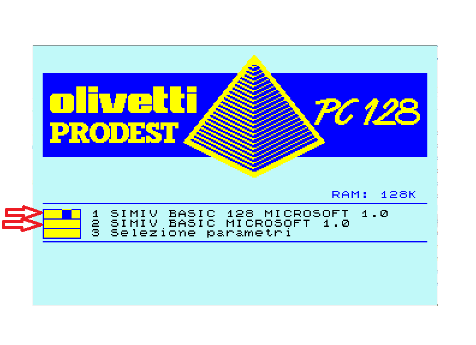
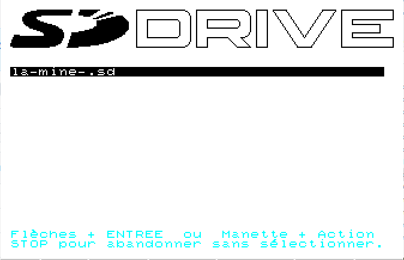

# SDCART
Interfaccia per il caricamento programmi da micro SD. Il progetto deriva dal progetto SDDRIVE di Deniel Coloumn (http://dcmoto.free.fr/bricolage/sddrive/index_v2.html) a cui spettano tutti i meriti did sviluppo hardware e software.
La variante SDCART consiste nell'utilizzo dello slot della cartuccia invece che lo slot di espanzione e l'utilizzo di memorie eeprom AT28C64/256 che danno la possibilità di aggiornare il software direttamente da PC128. 
 
La micro SD può essere formattata FAT o FAT32. Il limite di capacità è di 32 GByte. Dopo la formattazione deve essere copiato SDDRIVE.SEL come primo file. Successivamente si possono copiare le immagini dei floppy con estensione .SD. Ogni files .SD contiene l'immagine di quattro floppy virtuali da 360Kb, accessibili da BASIC come device da 0 a 3.
Il file immagine è selezionabile tramite un programma SDDRIVE.SEL che si avvia alla selezione del BASIC128 o BASIC1.0 del MENU principale del PC128. 

